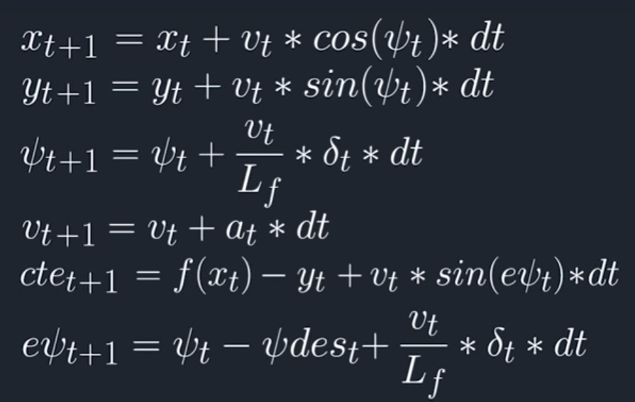

# Model Predictive Controller (MPC)

This repository implements a predictive model controller to drive a vehicle around the track. The model predictive controller uses the vehicle motion model to predict the outcome for the next 10 time steps ahead and computes the control signals (steering angles and throttle) by minimizing a cost function. The cost function can be modified to take into account different criteria of an excellent autonomous driving system. In the following paragraph, the rubric points are answered.

# Rubric Points
* **The Model: Student describes their model in detail. This includes the state, actuators and update equations.**

The original kinematic model for vehicle motion consists of 4 state as [x,y,v, psi] in which **x** and **y** are denoting the location of the **v** is the velocity and **psi** is the orientation of the car. This state vector has been extended by adding two more additional states to it namely **cte** (track error) and **epsi** (orientation error) which make the final state vector [x,y,v,psi,cte,epsi]. Adding the additional states are necessary for tracking the desired trajectory.

The model predict the states in the next time step based on the currect states and the control inputs namely **steering angle (delta)** and **throthel (a)** as decribed in the equations below:




* **Student discusses the reasoning behind the chosen N (timestep length) and dt (elapsed duration between timesteps) values. Additionally, the student details the previous values tried.**

The values are used based on the suggestion from Udacity office hours for the MPC project. **N=10** and **dt=0.1**. With these values, the model will predict the future states of the vehicle up to **N * dt = 1 Sec**, and finds the best control inputs to minimize the cost function over this **1 sec** window.

I also tried **N = 15** predicting the state up to **1.5 Sec**, the performance of **N = 10** seemed more reasnable.


* **If the student preprocesses waypoints, the vehicle state, and/or actuators prior to the MPC procedure it is described.**

All the waypoint were transformed to the vehicles coordinate system. Transforming the waypoints to the vehicles coordinate system makes it easier to fit a polynomial by making the vehicle coordinate system origin as **(0,0)** and the orientation is also zero, we do not have to compensate for those in the rest of the simulation.

* **The student implements Model Predictive Control that handles a 100-millisecond latency. Student provides details on how they deal with latency.**

Inorder to take into account the latency and compensate for it for setting up the vehicle model constraints I used the control inputs from one step before the current time. **dt = 0.1** which is exactly **100 milliseconds** by doing so the optimization problem will be solved to minimize the cost function considering that the input is going to be applied to the system 100 milliseconds later.


---

## Dependencies

* cmake >= 3.5
 * All OSes: [click here for installation instructions](https://cmake.org/install/)
* make >= 4.1(mac, linux), 3.81(Windows)
  * Linux: make is installed by default on most Linux distros
  * Mac: [install Xcode command line tools to get make](https://developer.apple.com/xcode/features/)
  * Windows: [Click here for installation instructions](http://gnuwin32.sourceforge.net/packages/make.htm)
* gcc/g++ >= 5.4
  * Linux: gcc / g++ is installed by default on most Linux distros
  * Mac: same deal as make - [install Xcode command line tools]((https://developer.apple.com/xcode/features/)
  * Windows: recommend using [MinGW](http://www.mingw.org/)
* [uWebSockets](https://github.com/uWebSockets/uWebSockets)
  * Run either `install-mac.sh` or `install-ubuntu.sh`.
  * If you install from source, checkout to commit `e94b6e1`, i.e.
    ```
    git clone https://github.com/uWebSockets/uWebSockets
    cd uWebSockets
    git checkout e94b6e1
    ```
    Some function signatures have changed in v0.14.x. See [this PR](https://github.com/udacity/CarND-MPC-Project/pull/3) for more details.

* **Ipopt and CppAD:** Please refer to [this document](https://github.com/udacity/CarND-MPC-Project/blob/master/install_Ipopt_CppAD.md) for installation instructions.
* [Eigen](http://eigen.tuxfamily.org/index.php?title=Main_Page). This is already part of the repo so you shouldn't have to worry about it.
* Simulator. You can download these from the [releases tab](https://github.com/udacity/self-driving-car-sim/releases).
* Not a dependency but read the [DATA.md](./DATA.md) for a description of the data sent back from the simulator.


## Basic Build Instructions

1. Clone this repo.
2. Make a build directory: `mkdir build && cd build`
3. Compile: `cmake .. && make`
4. Run it: `./mpc`.
